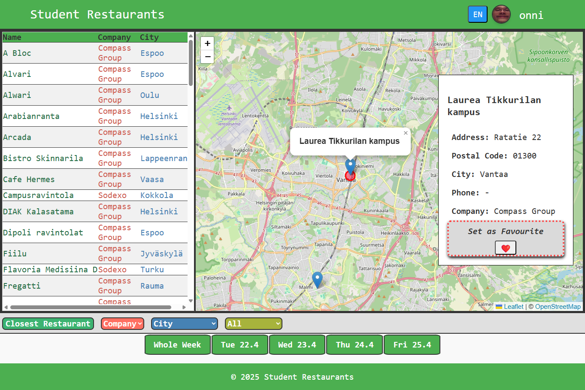

# Web Page Frontend

This project is part of the `wsk-web-development` course. The goal is to create a functional web application that fetches and displays weekly and daily menus from various student restaurants. The application aims to handle data inconsistencies and errors gracefully while providing a user-friendly interface.

## ⭐ Deployment and Server Information

The frontend for this project is deployed and accessible at [https://users.metropolia.fi/~onnikiv/Web-Sovelluskehitys/Web-page/](https://users.metropolia.fi/~onnikiv/Web-Sovelluskehitys/Web-page/). To use the frontend's functionality, ensure that the backend server is running and accessible.

The backend server for this project is accessible at [http://10.120.32.69/web-page](http://10.120.32.69/web-page). Note that the server does not have SSL authentication, so accessing it may require bypassing browser security warnings (e.g., using `thisisunsafe` in Chrome).

For more information about the backend, visit the [backend repository](https://github.com/onnikiv/Web-page-backend/tree/main).

---

### Features

- Fetch weekly and daily menus from multiple student restaurants.
- Display menus in both Finnish and English.
- Handle API errors and data inconsistencies effectively.
- Provide a clean and responsive user interface.

---

### Screenshots

#### Main Page



#### Additional Images

If you want to see more images, navigate to the `images` folder in the project directory. It contains various screenshots showcasing different features and pages of the application.

### Issues

1. Fetching `Stadin AO` student restaurant weekly menus in English results in an empty `name` attribute in the object. In Finnish, the object is as expected.

- **As of 15.4. ->** Fetching in English works, but the food names are in Finnish, and all weekday dates are identical. ( ͡° ͜ʖ ͡°)

```json
// Similar issue occurs in multiple restaurants
// when fetching in English
{
  "days": [
    {
      "date": "Saturday 19 April", // <----
      "courses": [
        {
          "name": "Lime-coriander cod, potatoes, and sour cream sauce",
          "diets": "L"
        },
        {"name": "Vegetable casserole with vebab", "diets": "M"},
        {"name": "Salad lunch with BBQ chicken", "diets": "M"}
      ]
    },
    {
      "date": "Saturday 19 April", // <----
      "courses": [
        {"name": "Salad lunch with feta cheese", "diets": "L, G"},
        {"name": "Spanish chicken soup", "diets": "M, G"},
        {"name": "Cheesy cauliflower soup", "diets": "L, G"}
      ]
    }
  ]
}
```

---

All `HAMK` restaurants return a `500` error when fetching `/weekly/`.

```json
{
  "message": "Cannot read properties of undefined (reading 'map')",
  "stack": "Error: Cannot read properties of undefined (reading 'map')\n at getWeeklyMenu (/home/ilkkamtk/apps/sodexo-webscrape/dist/src/api/controllers/restaurantController.js:123:14)\n at process.processTicksAndRejections (node:internal/process/task_queues:95:5)",
  "example": {
    "date": "Saturday 19 April",
    "courses": []
  }
}
```

Using `/daily` works fine, but every `HAMK` menu object is still empty.
